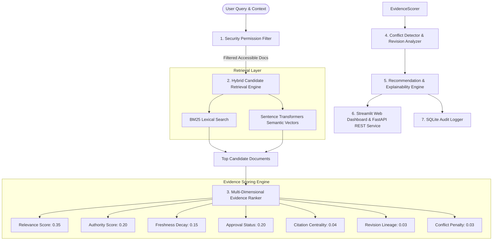

# System Architecture Documentation

## High-Level Architecture Diagram

## Security & Permission Model
The system enforces **Attribute-Based Access Control (ABAC)** and **Role-Based Access Control (RBAC)** *before* document scoring. Unauthorized documents are completely excluded from candidate sets, preventing snippet or metadata leakage (0.0% Permission Leakage Rate).

## Persistence Layer
The database utilizes SQLite (`enterprise_search.db`) with 11 relational tables managed via SQLAlchemy:
- `documents`
- `document_metadata`
- `revision_history`
- `permissions`
- `citations`
- `conflicts`
- `users`
- `search_logs`
- `feedback`
- `ranking_configs`
- `change_requests`
